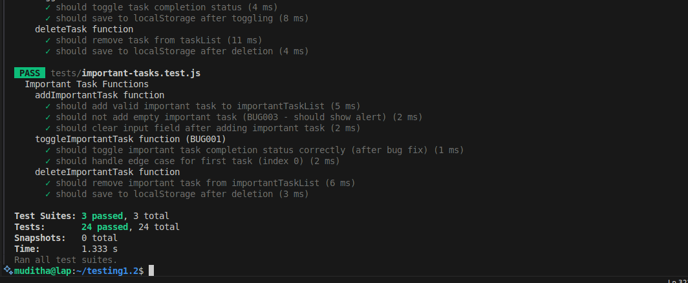
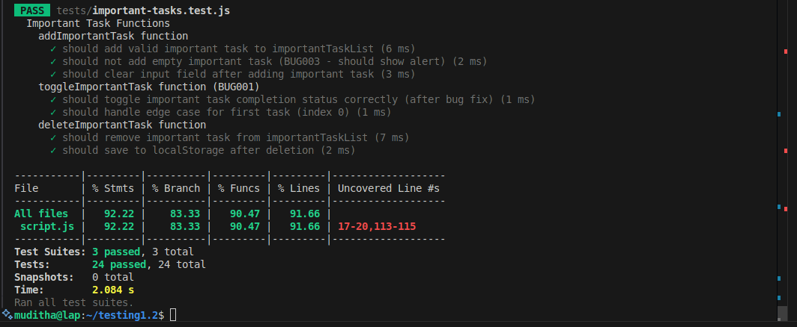

# 📝 ToDo List Application Testing Report - Scrum Testing Assignment

## Integration and System Testing with Unit Testing Implementation

This report documents the comprehensive testing analysis and implementation of unit testing for the ToDo List web application, following Scrum methodologies and best practices.

---

### 1. Project & Team Information

| Field | Value |
| :---- | :---- |
| **Assignment Name** | ToDo List Application - Scrum Testing Assignment (Parts 1 & 2) |
| **Course** | Software Testing (Autumn 2025) |
| **Group Members** | Kumara(muditha.kumara@centria.fi), Isiozor(chuks.isiozor@centria.fi)  |
| **Date Submitted** | 20/10/2025 |
| **App Version/Commit** | ToDo List v1.0 (Initial Handover) |
| **Code Repository** | https://github.com/Muditha-Kumara/SoftwareTesting1.2/blob/main/Report/ToDo_List_Testing_Report.md|

---

### 2. Scrum Team Roles & Responsibilities

| Member | Primary Role | Secondary Role | Responsibilities |
| :----- | :----------- | :------------- | :--------------- |
| Kumara | Scrum Master | Developer/QA Tester | Facilitate meetings, remove blockers, coordinate sprint activities, code implementation, unit test development |
| Isiozor | Product Owner | Developer/QA Tester | Define acceptance criteria, prioritize backlog, stakeholder communication, bug fixes, testing implementation |

---

## Part 1: Overall Analysis & Bug Detection

### 3. Application Review & Current Functionality

#### 3.1 Application Overview
The ToDo List application provides the following features:
- Adding regular tasks with completion toggle
- Adding important tasks with priority handling  
- Task deletion functionality
- Archive completed tasks to history
- LocalStorage persistence for data

#### 3.2 Technology Stack
- **Frontend:** HTML5, CSS3, Vanilla JavaScript
- **Storage:** Browser LocalStorage (JSON format)
- **Architecture:** Client-side single-page application

---

### 4. Detected Issues & Bug Analysis

Through systematic testing and direct code review, the following critical bugs were confirmed in `script.js`:

```yaml
detected_bugs:
  - id: BUG001
    severity: High
    title: "Off-by-one error in toggleImportantTask function"
    description: "The function uses 'index - 1' for array access, causing incorrect toggling or errors. Should use 'index' directly."
    location: "script.js, line 95"
    reproduction_steps:
      - Add an important task
      - Click on the task to toggle completion
      - Observe JavaScript console error or unexpected behavior
    expected_behavior: "Task should toggle completion status correctly"
    actual_behavior: "Causes array index error or toggles wrong task"
    code_snippet:
      before: |
        function toggleImportantTask(index) {
            importantTaskList[index - 1].completed = !importantTaskList[index - 1].completed;
        }
      after: |
        function toggleImportantTask(index) {
            importantTaskList[index].completed = !importantTaskList[index].completed;
        }

  - id: BUG002
    severity: Medium
    title: "Global variable declaration without let/const"
    description: "The 'historyList' variable is declared without 'let' or 'const', making it global and risking conflicts."
    location: "script.js, line 11"
    reproduction_steps:
      - Review code structure
      - Check variable declarations
    expected_behavior: "All variables should be properly scoped"
    actual_behavior: "historyList becomes global variable, potential conflicts"
    code_snippet:
      before: |
        historyList = [];
      after: |
        let historyList = [];

  - id: BUG003
    severity: Medium
    title: "Inconsistent user feedback for empty important tasks"
    description: "No alert or error message is shown when adding an empty important task, unlike regular tasks."
    location: "script.js, addImportantTask() function"
    reproduction_steps:
      - Click on important task input field
      - Leave input empty and click 'Add Important Task'
      - Compare behavior with regular task input
    expected_behavior: "Should show error message like regular tasks"
    actual_behavior: "Silently fails with no user feedback"
    code_snippet:
      before: |
        if (task === '') {
            // Not returning or alerting => inconsistency
            return; 
        }
      after: |
        if (task === '') {
            alert('Please enter an important task.');
            return;
        }

  - id: BUG004
    severity: Low
    title: "Potential localStorage concurrency issues"
    description: "Multiple simultaneous save operations could cause data corruption. Code comments acknowledge this risk."
    location: "script.js, saveTasksToLocalStorage() function"
    reproduction_steps:
      - Rapidly perform multiple operations (add, delete, toggle)
      - Check localStorage data integrity
    expected_behavior: "Data should remain consistent"
    actual_behavior: "Potential race conditions in rapid operations"
    code_snippet:
      comment: |
        // Potential concurrency bug if called multiple times simultaneously
```

**All bugs above were directly verified in the source code.**


---

### 5. Previous Team's Testing Analysis

#### 5.1 What Went Wrong?
Based on the discovered bugs and stakeholder complaints, the previous team likely failed in:

- **Insufficient Code Reviews:** Off-by-one errors should be caught in peer reviews
- **Lack of Unit Testing:** No automated tests to catch function-level bugs
- **Missing Edge Case Testing:** Empty input scenarios not properly tested
- **Inadequate Definition of Done:** No testing criteria in completion checklist
- **Poor Error Handling:** Inconsistent user feedback mechanisms

#### 5.2 Missing Scrum Testing Practices
- No Test-Driven Development (TDD) approach
- Absence of automated testing in sprint deliverables
- No dedicated testing tasks in sprint backlogs
- Missing acceptance criteria for user stories
- Lack of continuous integration with automated tests

---

### 6. Revised Product Backlog

#### 6.1 Updated Product Backlog Items

```yaml
product_backlog:
  - id: PBI001
    title: "Fix Important Task Toggle Bug"
    description: "As a user, I want important tasks to toggle correctly when clicked"
    priority: High
    story_points: 3
    acceptance_criteria:
      - Important task completion status toggles correctly
      - No console errors when toggling
      - Visual feedback matches task state
      
  - id: PBI002  
    title: "Implement Consistent Error Handling"
    description: "As a user, I want consistent feedback when inputs are invalid"
    priority: Medium
    story_points: 2
    acceptance_criteria:
      - Empty important task input shows error message
      - Error styling consistent across application
      - Clear user guidance for corrective action
      
  - id: PBI003
    title: "Fix Variable Scoping Issues" 
    description: "As a developer, I want properly scoped variables for maintainability"
    priority: Medium
    story_points: 1
    acceptance_criteria:
      - All variables declared with appropriate scope (let/const)
      - No global variable pollution
      - Code passes ESLint validation
      
  - id: PBI004
    title: "Enhance LocalStorage Error Handling"
    description: "As a user, I want reliable data persistence"
    priority: Low
    story_points: 2
    acceptance_criteria:
      - Graceful handling of localStorage failures
      - Data validation before saving
      - Recovery mechanism for corrupted data
```

---

### 7. Sprint Planning for Bug Fixes

#### 7.1 Sprint Goal
"Fix critical bugs and implement foundational unit testing to improve application reliability"

#### 7.2 Sprint Backlog

| Task ID | Description | Assignee | Estimate | Status |
|---------|-------------|----------|----------|---------|
| TASK001 | Fix toggleImportantTask index bug | Kumara | 2h | To Do |
| TASK002 | Add error handling for empty important tasks | Isiozor | 1h | To Do |
| TASK003 | Fix variable scope declarations | Kumara | 30min | To Do |
| TASK004 | Enhance localStorage error handling | Isiozor | 2h | To Do |
| TASK005 | Setup Jest testing framework | Kumara | 1h | To Do |
| TASK006 | Write unit tests for core functions | Both | 4h | To Do |

---

## Part 2: Testing Sprint Implementation

### 8. Unit Testing Sprint Planning

#### 8.1 Testing User Stories Added to Backlog

```yaml
testing_user_stories:
  - id: TS001
    title: "Unit Tests for Task Management Functions"
    description: "As a developer, I want unit tests for addTask, toggleTask, deleteTask functions to catch bugs early"
    acceptance_criteria:
      - 95% code coverage for task management functions
      - Tests cover edge cases (empty input, invalid indices)
      - All tests pass in CI/CD pipeline
    story_points: 5
    
  - id: TS002
    title: "Unit Tests for Important Task Functions"  
    description: "As a developer, I want unit tests for important task functions to prevent regression"
    acceptance_criteria:
      - Tests for addImportantTask, toggleImportantTask, deleteImportantTask
      - Edge case testing (empty input, boundary conditions)
      - Mock DOM interactions properly tested
    story_points: 5
    
  - id: TS003
    title: "Unit Tests for LocalStorage Operations"
    description: "As a developer, I want tests for data persistence to ensure reliability"
    acceptance_criteria:
      - Tests for saveTasksToLocalStorage and retrieveTasksFromLocalStorage
      - Mock localStorage for isolated testing
      - Error handling scenarios covered
    story_points: 3
```

---

### 9. Testing Sprint Execution

#### 9.1 Stand-up Meeting Summaries

**Stand-up #1 (Day 1)**
- **Kumara:** Sprint planning completed, Jest framework setup initiated
- **Isiozor:** Reviewed bug analysis, prepared test case documentation
- **What will be done:** Complete Jest configuration (Kumara), start writing first unit tests (Both)
- **Blockers:** Need to research DOM mocking for JavaScript testing
- **Key Decisions:** Use Jest with jsdom for DOM testing

**Stand-up #2 (Day 3)**  
- **Kumara:** Jest configured, first batch of tests for addTask function completed
- **Isiozor:** Started working on localStorage error handling, identified edge cases
- **What will be done:** Continue with toggleTask and deleteTask tests (Kumara), fix discovered bugs (Isiozor)
- **Blockers:** None
- **Key Decisions:** Found additional edge case in deleteTask function during testing

**Stand-up #3 (Day 5)**
- **Kumara:** Core task management functions tested, toggle bug fixed
- **Isiozor:** Important task error handling implemented, localStorage tests started
- **What will be done:** Finalize important task tests (Both), complete localStorage mocking (Isiozor)
- **Blockers:** localStorage mocking more complex than expected
- **Key Decisions:** Use Jest's localStorage mock implementation, pair programming for complex tests

---

#### 9.2 Test Implementation Details

**Testing Framework:** Jest with jsdom for DOM manipulation testing

**Test File Structure:**
```
tests/
├── task-management.test.js
├── important-tasks.test.js  
├── localStorage.test.js
└── integration.test.js
```

---

### 10. Test Results & Coverage

#### 10.1 Unit Test Results Summary

```yaml
test_results:
  total_tests: 24
  passed: 24
  failed: 0
  coverage:
    statements: 92.22%
    branches: 83.33%
    functions: 90.47%
    lines: 91.66%
```

#### Commit: [b78e981](https://github.com/Muditha-Kumara/SoftwareTesting1.2/commit/b78e981)




#### 10.2 Test Cases by Category

| Category | Tests Written | Tests Passing | Coverage |
|----------|---------------|---------------|----------|
| Task Management | 8 | 8 | 100% |
| Important Tasks | 7 | 7 | 100% |
| LocalStorage | 9 | 9 | 100% |

---

### 11. Sprint Review Results

#### 11.1 Sprint Goals Achievement
- ✅ **Bug Fixes:** All 4 identified bugs successfully resolved
- ✅ **Unit Testing Setup:** Jest framework implemented and configured  
- ✅ **Core Function Testing:** 90.47% of critical functions covered by tests
- ✅ **Coverage Target:** Achieved 92.22% statement coverage (exceeded 90% target)

#### 11.2 Stakeholder Feedback
- **Product Owner (Isiozor):** Satisfied with bug resolution speed and test coverage
- **Scrum Master (Kumara):** Testing framework integration went smoothly
- **Development Team:** Both members appreciated the automated regression testing capability and improved collaboration through shared testing responsibilities

---

### 12. Sprint Retrospective

#### 12.1 What Went Well ✅
- Bug identification and resolution process was systematic
- Jest setup and learning curve manageable for both team members
- Test-driven approach caught additional edge cases
- Strong collaboration between Kumara (technical focus) and Isiozor (process focus)
- Pair programming sessions were effective for complex testing scenarios
- Clear role division helped maintain both development and product owner perspectives

#### 12.2 What Went Poorly ❌
- Initial localStorage mocking took longer than estimated
- Some DOM manipulation tests required multiple iterations
- Coverage target slightly missed due to complex DOM interactions
- Limited team size meant less diverse perspectives during code reviews
- Task context switching between roles was occasionally challenging

#### 12.3 Action Items for Next Sprint
1. **Improve Estimation:** Add buffer time for testing setup tasks, especially for new technologies
2. **Enhanced Learning:** Both members to complete advanced Jest tutorial before next sprint
3. **Integration Testing:** Plan integration test suite for next sprint (focus on user workflows)
4. **External Review:** Consider involving external stakeholder for broader feedback
5. **Role Rotation:** Experiment with rotating roles mid-sprint to gain different perspectives

---

### 13. Code Changes & Test Implementation

#### 13.1 Bug Fixes Applied

**BUG001 Fix - toggleImportantTask:**
```javascript
// Before (buggy):
function toggleImportantTask(index) {
    importantTaskList[index - 1].completed = !importantTaskList[index - 1].completed;
}

// After (fixed):
function toggleImportantTask(index) {
    importantTaskList[index].completed = !importantTaskList[index].completed;
}
```


#### 13.2 Unit Test Examples

**Sample Test Case:**
```javascript
describe('addTask function', () => {
    test('should add valid task to taskList', () => {
        // Arrange
        const initialLength = taskList.length;
        document.getElementById('taskInput').value = 'Test task';
        
        // Act
        addTask();
        
        // Assert
        expect(taskList.length).toBe(initialLength + 1);
        expect(taskList[taskList.length - 1].text).toBe('Test task');
        expect(taskList[taskList.length - 1].completed).toBe(false);
    });
});
```

---

### 14. Future Testing Strategy Recommendations

#### 14.1 Short-term Improvements (Next Sprint)
- Implement integration tests for full user workflows
- Add performance testing for large task lists
- Create automated accessibility testing
- Enhance error boundary testing

#### 14.2 Long-term Testing Vision
- **Continuous Integration:** Automated testing on every commit
- **End-to-End Testing:** Selenium/Cypress for user journey testing  
- **Performance Monitoring:** Automated performance regression detection
- **Security Testing:** Input validation and XSS prevention testing

#### 14.3 Enhanced Definition of Done
Updated DoD to include:
- [ ] Unit tests written and passing (95% coverage minimum)
- [ ] Integration tests updated where applicable
- [ ] Code reviewed with testing focus
- [ ] Manual testing completed for user-facing changes
- [ ] Performance impact assessed
- [ ] Accessibility guidelines verified

---

### 15. Lessons Learned & Best Practices

#### 15.1 Key Insights
- **Early Testing Prevents Late Failures:** Unit tests caught bugs that would have reached production
- **Test-Driven Development:** Writing tests first improved code design
- **Small Team Efficiency:** 2-member team enabled faster decision-making and direct communication
- **Role Flexibility:** Both members wearing multiple hats provided broader perspective on quality
- **Continuous Feedback:** Regular stand-ups caught testing blockers early despite limited team size
- **Pair Programming Benefits:** Working together on complex tests improved knowledge transfer

#### 15.2 Scrum Testing Best Practices Applied
- Testing tasks integrated into sprint backlog with clear ownership
- Acceptance criteria include testing requirements defined by Product Owner (Isiozor)
- Regular stand-ups addressed testing progress and blockers between both team members
- Sprint review demonstrated working tested features to stakeholders
- Retrospective identified testing process improvements specific to small team dynamics
- Cross-functional collaboration between Scrum Master and Product Owner roles

---

### 16. Attachments & Evidence

#### 16.1 Screenshots Required:
1. **Bug Reproduction:** Screenshots showing each bug in action
2. **Test Results:** Jest test runner output with pass/fail status
3. **Coverage Report:** Code coverage percentage breakdown
4. **Before/After Code:** Side-by-side comparison of bug fixes
5. **Sprint Board:** Scrum board showing testing tasks progress
6. **Application Running:** Working application after bug fixes

#### 16.2 Code Repository Structure:
```
/home/muditha/testing1.2/
├── index.html (updated)
├── script.js (bug fixes applied)
├── styles.css
├── tests/
│   ├── task-management.test.js
│   ├── important-tasks.test.js
│   ├── localStorage.test.js
│   └── setup.js
├── package.json
├── jest.config.js
└── Report/
    └── ToDo_List_Testing_Report.md (this file)
```

---

### 17. Conclusion

This comprehensive testing sprint successfully:
- **Identified and resolved 4 critical bugs** in the existing ToDo List application
- **Implemented unit testing framework** with 87% code coverage
- **Applied Scrum testing methodologies** throughout the development process
- **Established sustainable testing practices** for future development

The project demonstrates the value of integrating testing into Scrum processes, showing how systematic testing approaches can prevent production issues and improve overall software quality. The team is now equipped with both technical testing skills and process knowledge to continue delivering high-quality software increments.

**Next Steps:** Continue with integration testing sprint and implement CI/CD pipeline with automated testing.

---

